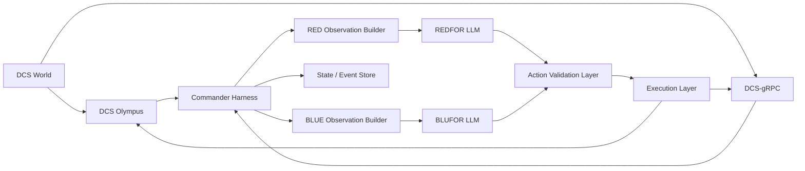

# Architecture Overview

## Project

DCS Dungeon Master

## Status

Draft 0.1

## Purpose

This document defines the Phase 1 system architecture for DCS Dungeon Master. It describes the major components, how data moves through the system, where trust boundaries exist, how two coalition commanders operate on the same world, and how the harness separates perception, reasoning, validation, and execution.

This is a system design document, not a code layout document. It describes the architecture the implementation should satisfy.

## Scope

This architecture covers the Phase 1 baseline defined by:

- `project-docs/PRD.md`
- `project-docs/OBSERVATION-SPEC.md`
- `project-docs/SCENARIO-SPEC.md`
- `project-docs/ACTION-SPEC.md`

Phase 1 assumptions:

- One REDFOR commander
- One BLUFOR commander
- Strategic ground-command focus
- Sector-based observation model
- Bounded high-level action vocabulary
- Olympus and DCS-gRPC used as complementary interfaces

## Architectural Principles

- Fairness first: commanders must not receive omniscient state
- Structure over raw media: structured observation is canonical even when multimodal inputs are used
- Bounded agency: the model proposes intent, the harness validates and executes
- Provider neutrality: model hosting should be swappable without changing the core world loop
- Replayability: every major decision boundary should be loggable and reproducible
- Separation of concerns: perception, state, reasoning, validation, and execution should stay distinct

## Current Implementation Notes

- The only real model transport implemented today is an OpenAI-compatible adapter, primarily targeting LM Studio and similar endpoints.
- Structured JSON output is the primary model-return path and is preferred over free-form text responses.
- Optional multimodal support is implemented as a backend-gated image attachment path. Structured JSON remains authoritative even when an attachment is submitted alongside the canonical observation.
- Backend failover is implemented as one primary backend plus one optional fallback backend per coalition. Failover is only used for transport or parse failure and reuses the same observation snapshot.
- Action validation is constrained to scenario-known, coalition-owned, and coalition-visible data. Hidden world truth is not part of legality decisions.

## System Context

At a high level, the harness sits between DCS World and one or more LLM backends.

- DCS World is the simulation authority
- Olympus is the primary high-level command and map-control surface
- DCS-gRPC is the primary perception and event-ingest surface
- The harness maintains the internal world and campaign state
- Each coalition commander receives a filtered observation from the harness
- The harness validates and translates accepted actions back into simulator commands

## High-Level Architecture

## Major Components

### 1. Simulation Integration Layer

This layer connects the harness to DCS-adjacent interfaces.

Subcomponents:

- Olympus client
- DCS-gRPC client
- Interface adapters for polling, streaming, and command submission

Responsibilities:

- Read coalition-visible state from Olympus where appropriate
- Ingest streaming data and events from DCS-gRPC
- Submit bounded, validated commands back into DCS
- Normalize source-specific payloads into internal domain objects

### 2. Internal World State Layer

This layer maintains the harness-owned internal representation of the battlefield.

Responsibilities:

- Track current friendly and enemy-known state
- Track sector graph, control points, and scenario geography
- Track unit groups, reserves, attrition, and availability
- Track recent events and state changes across cycles
- Maintain enough detail for execution and replay without exposing that detail directly to the model

Important distinction:

- The internal world state may be richer than the exported commander observation
- Rich internal state must not bypass the observation layer’s anti-cheat rules

### 3. Sensor Fusion And Fog-Of-War Layer

This layer converts raw and mixed-quality perception into coalition-safe knowledge.

Responsibilities:

- Fuse detection-based contacts into coalition-level track pictures
- Distinguish observed, inferred, and unknown state
- Apply confidence and staleness rules
- Prevent omniscient world data from reaching commander observations
- Build separate knowledge pictures for REDFOR and BLUFOR

This is one of the most important trust boundaries in the system.

### 4. Scenario And Campaign State Layer

This layer owns scenario rules and coalition resource governance.

Responsibilities:

- Load and enforce sector graph and control-point definitions
- Track deployment budgets and reserve pools
- Track attrition and resource exhaustion
- Track scenario-specific deployment restrictions
- Provide the authoritative source for what is legally deployable and where

This layer is what stops the model from turning Olympus into an unlimited sandbox.

### 5. Observation Builder

This layer produces the commander-facing payloads defined by `project-docs/OBSERVATION-SPEC.md`.

Responsibilities:

- Build one observation for REDFOR
- Build one observation for BLUFOR
- Summarize sectors, friendly groups, enemy contacts, and deltas
- Include coalition-private standing orders and resource state
- Keep payloads concise and stable across runs

Outputs:

- Canonical structured observation object
- Optional model-facing rendering
- Optional coalition-filtered visual attachment for multimodal-capable models

### 6. Model Adapter Layer

This layer abstracts over local, LAN, and hosted model runtimes.

Responsibilities:

- Provide a common interface for prompt submission and structured tool use
- Support provider-specific settings such as endpoint, auth, model name, and timeouts
- Preserve the same action and observation contract regardless of model backend
- Support optional multimodal attachments for Gemma or other capable models

Expected Phase 1 backends:

- Local runtimes such as LM Studio, Ollama, or vLLM
- LAN-hosted runtimes using similar APIs
- Hosted providers such as OpenAI, Anthropic, and Gemini

### 7. Action Validation Layer

This layer receives model-proposed actions and decides whether they are acceptable.

Responsibilities:

- Enforce the action schema from `project-docs/ACTION-SPEC.md`
- Validate coalition ownership and entity references
- Validate scenario legality and routing rules
- Validate budgets, reserve availability, and current state
- Reject or partially accept action batches with machine-readable reasons

This is the second major trust boundary after fog-of-war filtering.

### 8. Execution Layer

This layer translates accepted strategic actions into bounded simulator-side operations.

Responsibilities:

- Turn high-level intent into Olympus and/or DCS-gRPC commands
- Handle route generation, activation, posture changes, and movement
- Maintain standing orders between LLM decision cycles
- Apply deterministic tactical handling between strategic decisions

Examples:

- `deploy_reserve_group` becomes a reserve activation plus spawn/placement sequence
- `reposition_group` becomes a route and movement update
- `set_group_posture` becomes posture and option changes in the execution model

### 9. Persistence And Replay Layer

This layer stores enough system history to support evaluation and debugging.

Responsibilities:

- Persist observations
- Persist proposed and validated actions
- Persist execution results
- Persist resource and standing-order changes
- Persist event history needed for replay or audit

Phase 1 recommendation:

- Use an append-oriented event log plus materialized current-state views

### 10. Operator And Debug Layer

This layer is not a polished end-user UI in Phase 1. It exists to make the system inspectable and controllable.

Responsibilities:

- Start, pause, resume, and stop a run
- Enable dry-run mode
- Inspect last observation per coalition
- Inspect accepted and rejected actions
- Review world-state summaries and errors

## Data Flow

### Continuous Ingest Path

1. DCS World emits state and events through Olympus and DCS-gRPC
2. Integration clients normalize raw payloads
3. Internal world state is updated
4. Sensor fusion updates REDFOR and BLUFOR knowledge pictures
5. Scenario and campaign state are refreshed as needed

### Commander Decision Path

1. A decision timer fires for each commander cycle
2. Observation builder creates one filtered observation per coalition
3. Observation is sent to the coalition’s assigned model backend
4. The model returns zero or more bounded action requests
5. Action validation layer accepts, rejects, or partially accepts them
6. Accepted actions are translated by the execution layer
7. Execution results are persisted for replay and later evaluation

### Inter-Cycle Execution Path

Between decision cycles:

- Standing orders remain active
- Execution logic continues to manage accepted plans
- Tactical housekeeping can occur deterministically without asking the LLM again

## Dual-Commander Model

Phase 1 includes two simultaneous commanders acting on the same world.

### Command Separation

- REDFOR and BLUFOR each have their own observation
- Each coalition has its own private resources, standing orders, and action stream
- Neither side sees the other side’s private planning state

### World Coupling

- Both sides operate on a single shared simulation world
- Accepted actions from one side change the world that the other side later observes
- Cross-coalition interaction occurs only through legitimate simulation consequences

### Scheduling

The architecture should support two safe execution modes:

- Near-simultaneous decision cycles from a common snapshot
- Serialized decision handling from a common snapshot when operational simplicity is preferred

The common requirement is snapshot fairness: one side should not observe hidden consequences of the other side’s not-yet-public decision before its own cycle is evaluated.

## Trust Boundaries

The architecture contains three critical trust boundaries.

### 1. Raw World Data To Internal State

The harness may ingest rich simulation data, but this data is not automatically safe for commander use.

### 2. Internal State To Commander Observation

This is the anti-cheat boundary.

- Export only coalition-filtered knowledge
- Mark inference as inference
- Preserve uncertainty and staleness
- Never pass hidden enemy truth directly to the commander

### 3. Commander Intent To Simulator Commands

This is the bounded-agency boundary.

- The model cannot call simulator APIs directly
- Every requested action must pass validation
- Execution is always mediated by the harness

## Canonical Data Objects

Phase 1 does not need a full implementation schema here, but the architecture should assume the following internal object families exist:

- `ScenarioDefinition`
- `SectorState`
- `ControlPointState`
- `CoalitionState`
- `ReserveGroupState`
- `ActiveGroupState`
- `ContactTrack`
- `ObservationSnapshot`
- `ActionRequest`
- `ValidatedAction`
- `ExecutionResult`

These object families should be stable enough that persistence, observation, validation, and execution all speak the same domain language.

## Deployment Model

The architecture must support three deployment patterns.

### 1. Same-Machine Local Model

- Harness and model runtime run on the same machine
- Best for local iteration
- Lowest network latency

### 2. LAN-Hosted Model

- Harness connects to a model runtime on another machine in the local network
- Useful when DCS and the model runtime should not compete on the same hardware

### 3. Hosted Provider

- Harness connects to a cloud API
- Useful for comparison and evaluation
- Higher latency and higher external dependency risk

The rest of the architecture should not materially change across these modes.

### Remote DCS Host

The architecture must also support DCS World running on a separate machine from the harness.

This is an important deployment mode for Phase 1 because it allows:

- The simulation host to remain dedicated to DCS performance
- The harness and model runtime to run on different hardware
- More flexible use of local GPUs, LAN-hosted models, or hosted providers

In this mode:

- DCS World runs on a remote Windows machine
- Olympus is exposed for remote harness access
- DCS-gRPC is exposed for remote perception and event ingest
- The harness connects over the network to both interfaces

Requirements:

- Olympus backend must be configured for direct remote API access
- DCS-gRPC must bind to a reachable network interface
- Firewall and network rules must allow only the intended hosts to connect
- The harness must treat the remote simulation host as the authoritative world source exactly as it would in a same-machine setup

Architecturally, this does not change the trust boundaries or the commander loop. It only changes network topology and operational concerns such as latency, reachability, and service configuration.

## Optional Multimodal Path

Structured observation remains canonical in Phase 1.

If a multimodal-capable model such as Gemma is used, the architecture may attach:

- Coalition-filtered map images
- Rendered sector overviews
- Structured-overlay visual references

Rules:

- The visual path is supplementary
- The same snapshot boundary must be respected
- Visual attachments must not reveal hidden state absent from the structured observation

## State Ownership

The architecture should clearly separate ownership of truth.

- DCS World owns simulation truth
- The scenario layer owns game-rule truth for the harness
- The campaign/resource layer owns deployment and availability truth
- The observation layer owns commander-facing filtered truth
- The execution layer owns translation from accepted plan to simulator operations

This prevents a common failure mode where every layer makes up its own version of availability, legality, or visibility.

## Failure Handling

The architecture should anticipate partial failure without collapsing the whole run.

### Expected Failure Classes

- Model timeout or provider error
- Olympus command failure
- DCS-gRPC disconnect or stream interruption
- Invalid action batch from the model
- Conflicting or stale entity references

### Phase 1 Behavior

- Preserve the last valid standing orders when a commander cycle fails
- Log failures with enough context for replay and diagnosis
- Reject invalid actions rather than improvising broad behavior changes
- Resume normal operation on the next valid cycle when possible

## Observability

The system should make the following easy to inspect:

- Last observation per coalition
- Last proposed actions per coalition
- Validation results and rejection reasons
- Current standing orders
- Current resource state
- Current sector summary
- Recent execution outcomes and failures

## Security And Safety Notes

Phase 1 safety is mostly about bounded behavior rather than external adversaries.

Primary safeguards:

- Coalition filtering before model observation
- Narrow action vocabulary
- Deterministic validation
- No direct simulator API exposure to the model
- Dry-run mode for testing

## Phase 1 Recommended Module Boundaries

The codebase should likely separate concerns into modules resembling:

- integration
- world_state
- sensor_fusion
- scenario_state
- observation
- model_adapter
- action_validation
- execution
- persistence
- operator_control

These names are illustrative, not mandatory.

## Out Of Scope For This Architecture

Phase 1 architecture does not need to fully solve:

- Theater-wide air package planning
- Rich logistics chains
- Voice interfaces
- Human-grade tactical aircraft control
- Large multi-agent swarms within each coalition

## Open Questions

- Should both commanders share one scheduler process or run as two isolated worker loops over a shared state store?
- How much tactical autonomy should the execution layer own before it begins to mask poor strategic decisions?
- Should the persistence layer be fully event-sourced from the start or phased in gradually?
- How should scenario-authorable routes and no-deploy zones be represented internally?

## Relationship To Other Documents

- `project-docs/PRD.md` defines the product goals
- `project-docs/OBSERVATION-SPEC.md` defines the commander input contract
- `project-docs/ACTION-SPEC.md` defines the commander output contract
- `project-docs/SCENARIO-SPEC.md` defines the first battlefield this architecture supports
- `project-docs/EVAL-PLAN.md` should define how this architecture is tested and compared
